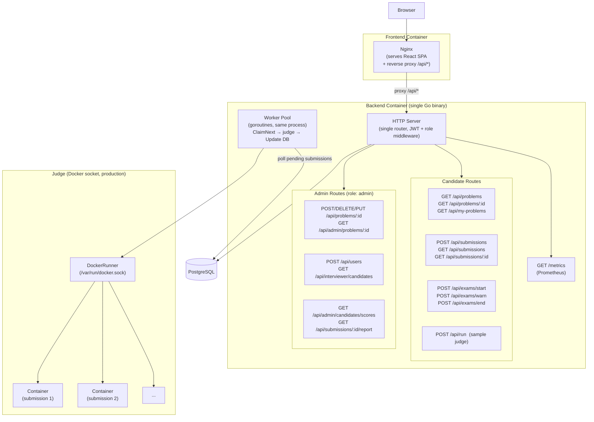

# SMC System Architecture

## Notes

- **Single binary**: The HTTP server and worker pool run in the same Go process. There is no separate orchestrator service.
- **Role-based routing**: "Candidate" and "Admin" are not separate services — they are route groups within one router, protected by `RequireRole("admin")` middleware.
- **Judge backend**: `JUDGE_BACKEND=docker` in all compose files. `ProcessRunner` is a fallback for bare `go run` without a `.env` and is not used in any deployed environment.
- **Judge queue**: Backed by the `submissions` table in PostgreSQL (status: `pending → running → done`). No separate message queue.
- **Nginx**: Lives in the frontend container only. There is no separate API gateway.
